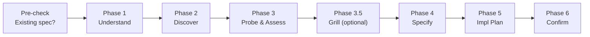
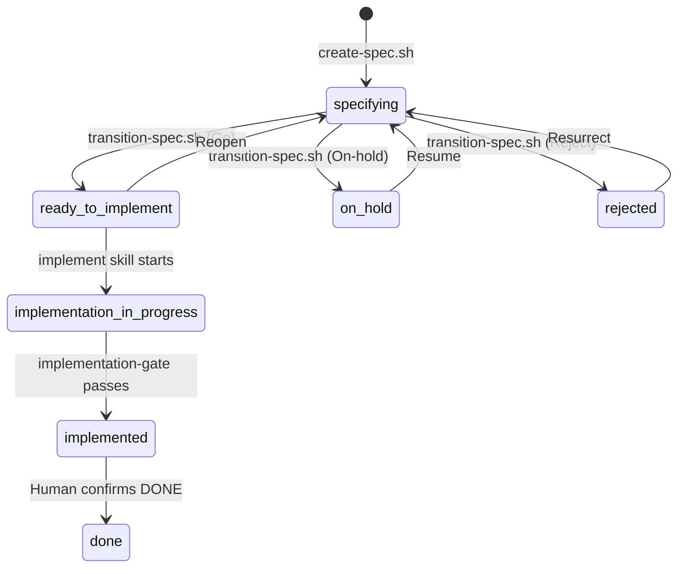

# specify — Structured Spec Creation Skill

specify guides the creation and refinement of implementation specs. It validates understanding, explores the codebase, probes gaps, produces acceptance criteria with behavioral examples, and requires explicit approval before implementation can begin.

## When to Use

Invoke specify when you want to produce a **ready-to-implement spec** for a change — before writing any production code.

**Trigger**: Manual only. Type `/specify` or `run specify`. The skill will **not** auto-trigger from keywords like "fix", "build", or "implement".

## How It Works

specify runs through 6 phases, each with a user checkpoint before proceeding:



### Pre-check — Existing Spec

Before starting, specify searches `docs/backlog/` for matching specs (same project, same files, or same title slug). If found, it routes based on status:

| Status | Action |
|--------|--------|
| `specifying` | Continue refinement from the relevant phase |
| `ready-to-implement` | Ask whether to reopen or keep approved |
| `on-hold` | Ask whether to resume |
| `rejected` | Surface rejection context, ask whether to resurrect |
| No match | Start from Phase 1 |

### Phase 1 — Understand

Restate the problem, expected change, and out-of-scope items. Surface doubts and ambiguities. Ask **"Did I get it right?"** — the user must confirm before proceeding.

### Phase 2 — Discover

Explore the codebase: related code paths, docs, overlapping specs, impacted behaviors. Produces a summary of current behavior, touched areas, and likely impact.

**Bounded exploration** — uses relevance heuristics (entry point, 3-level call depth, test proximity, doc priority, stop signals) to avoid getting lost.

### Phase 3 — Probe & Assess

Ask clarifying questions (max 3 per round) covering why, what, size, risk, and gaps. Then produce a health assessment:

| Dimension | Score | Meaning |
|-----------|-------|---------|
| WHY | 🟢🟡🔴 | Problem clarity |
| WHAT | 🟢🟡🔴 | Change clarity |
| SIZE | 🟢🟡🔴 | Scope estimate (XS/S/M/L) |
| RISK | 🟢🟡🔴 | Risk level |
| GAPS | 🟢🟡🔴 | Missing information |

**Blocking rules**: Any 🔴 blocks Phase 4. L-sized work must be split into ≥2 independent specs.

### Phase 3.5 — Grill (optional)

Offer to run `/grill-me` to stress-test decisions before writing the spec. Uses Phase 2 codebase context to ask sharp, specific questions. Skipped for XS/S specs with 🟢 across all dimensions.

### Phase 4 — Specify

Create or update a spec file in `docs/backlog/todo/` using `create-spec.sh`. Fill using the spec template. Quality requirements:

- Clear context, scope boundaries, and non-goals
- Acceptance criteria with `[TEST]` or `[MANUAL]` markers
- Behavioral examples with realistic data (min 1 per criterion + 1 edge case)
- Health Check table populated from Phase 3
- Self-review against the Spec Quality Checklist
- `validate-spec.sh` must pass before proceeding

### Phase 5 — Implementation Plan

Derive a step-by-step plan from the spec. Each increment specifies:

- **What**: files to create/modify/delete
- **How**: design decisions, naming, layout
- **Validation**: build/test command and expected outcome
- **Commit**: conventional commit message draft

The plan is written into the spec file (the handoff artifact) and mirrored in the conversation.

### Phase 6 — Confirm

Present the spec and implementation plan. Request an explicit decision:

| Decision | Action |
|----------|--------|
| ✅ Go | `transition-spec.sh <file> ready-to-implement` → **STOP** |
| 🔄 Iterate | Back to relevant phase |
| 🛑 On-hold | `transition-spec.sh <file> on-hold` |
| 🗑️ Reject | Record reason, `transition-spec.sh <file> rejected` |

After approval, the skill **stops**. Implementation happens in a fresh session.

## Spec Status Lifecycle



| Status | Directory | Meaning |
|--------|-----------|---------|
| `specifying` | `docs/backlog/todo/` | Draft or refinement in progress |
| `ready-to-implement` | `docs/backlog/todo/` | Approved AND validated, awaiting work start |
| `on-hold` | `docs/backlog/todo/` | Deferred |
| `implementation-in-progress` | `docs/backlog/in-progress/` | Work started |
| `implemented` | `docs/backlog/in-progress/` | Implementation complete, awaiting sign-off |
| `done` | `docs/backlog/done/` | Human confirmed done |
| `rejected` | `docs/backlog/rejected/` | Won't do (can be resurrected) |

## Scripts

| Script | Purpose |
|--------|---------|
| `scripts/create-spec.sh <slug>` | Scaffold a new spec file with frontmatter |
| `scripts/validate-spec.sh <file>` | Validate spec structure (frontmatter, required sections) |
| `scripts/transition-spec.sh <file> <status>` | Transition spec status (re-validates on `ready-to-implement`) |

## Templates

- `templates/spec-template.md` — Spec file template with all required sections and placeholders

## File Structure

```
.agents/skills/specify/
├── SKILL.md                        # Skill definition and process
├── docs/
│   └── README.md                   # This file
├── evals/
│   ├── evals.json                  # Eval prompts and assertions
│   ├── run-eval.sh                 # Baseline record/compare helper
│   └── baseline/
│       └── benchmark.json          # Baseline snapshot (100% pass rate)
├── references/
│   └── output-formats.md           # Phase output format specifications
├── scripts/
│   ├── create-spec.sh
│   ├── validate-spec.sh
│   └── transition-spec.sh
└── templates/
    └── spec-template.md
```

## Regression Protection

The skill has an eval suite that detects behavioral regressions. After any change to the skill, run the evals to verify nothing broke.

### What the evals cover

| Eval | Focus | Assertions | Type |
|------|-------|------------|------|
| 1 | Full Phase 1–6 flow | 12 | Positive — correct behavior |
| 2 | Manual-only trigger guard | 4 | Negative — "fix" keyword must NOT auto-trigger |
| 3 | Pre-check routing for existing specs | 10 | Positive — pre-check + normal flow |

**Total: 26 assertions** across 3 evals.

### Running evals

Tell the Oz agent **"run specify evals"**. The agent will:

1. Spawn subagents for each eval (one with the skill, one without for baseline)
2. Grade outputs against the assertions in `evals/evals.json`
3. Compare with_skill pass rate against the baseline in `evals/baseline/benchmark.json`

### Using run-eval.sh

The helper script sets up directories and displays the eval summary:

```bash
# First time: record the baseline
./evals/run-eval.sh --record-baseline

# After changes: compare against baseline
./evals/run-eval.sh --compare
```

**Note**: The actual subagent execution requires the Oz agent orchestration. `run-eval.sh` prepares the structure; say **"run specify evals"** to execute the full evaluation.

### Interpreting results

- **with_skill pass rate = 1.0** → no regression
- **with_skill pass rate < 1.0** → regression detected — investigate before merging
- **without_skill pass rate** serves as a control — it shows what happens without the skill (expected: lower on positive evals, same on negative evals)

### Current baseline

| Eval | with_skill | without_skill | Delta |
|------|-----------|--------------|-------|
| 1 (full flow) | 12/12 (100%) | 4/12 (33%) | +67% |
| 2 (trigger guard) | 4/4 (100%) | 4/4 (100%) | 0% (negative test) |
| 3 (pre-check) | 10/10 (100%) | 1/10 (10%) | +90% |

### Updating the baseline

After intentionally changing skill behavior (e.g., adding a new phase):

1. Run the evals: **"run specify evals"**
2. Verify the new results are intentional
3. Update the baseline snapshot:
   ```bash
   cp specify-workspace/iteration-N/benchmark.json evals/baseline/benchmark.json
   ```
4. Commit the updated baseline

## Guard Rails

1. **Manual trigger only** — never auto-trigger from implementation keywords
2. **No implementation** — no production code, tests, or migrations; only spec files
3. **No spec bypass** — if a spec exists in `specifying`, continue its refinement
4. **Re-evaluate on new info** — if user input contradicts earlier conclusions, loop back

## Integration with Other Skills

- **grill-me**: Optional Phase 3.5 stress-test of decisions before spec writing
- **implementation-gate**: After implementation, validates spec alignment, test coverage, and build status
- **implement skill**: Executes the Implementation Plan from the approved spec in a fresh session
