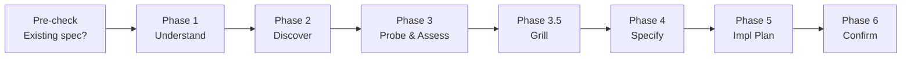
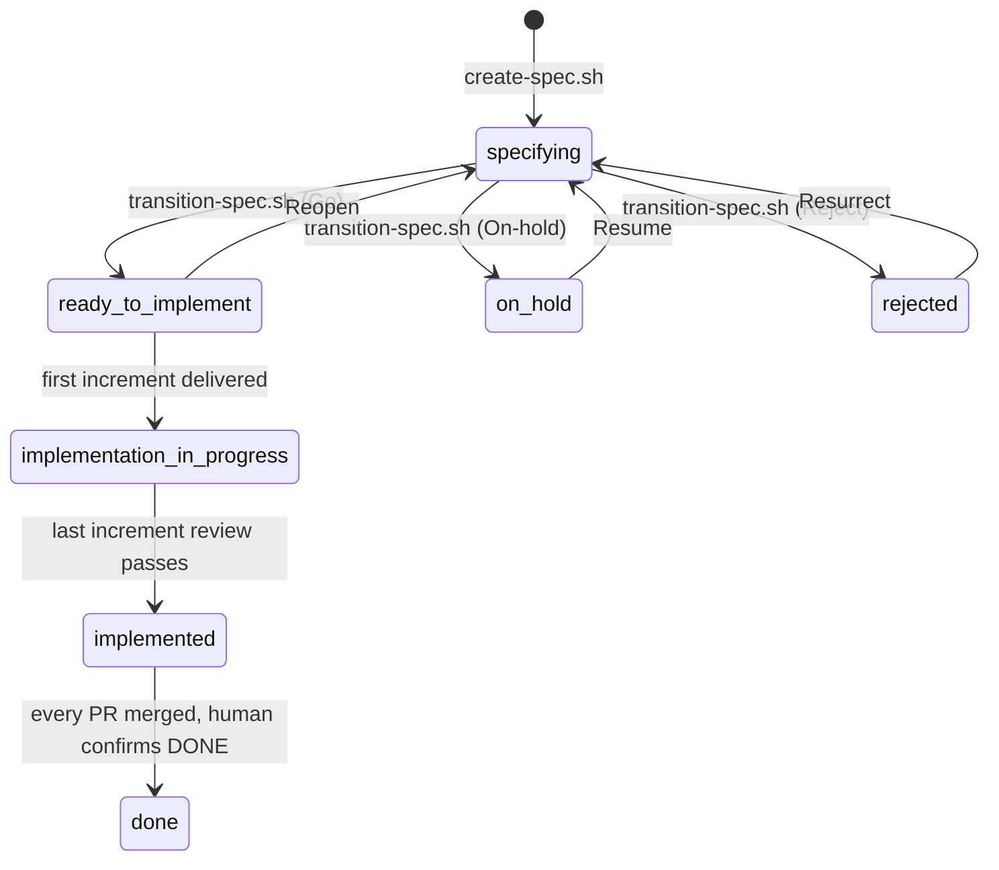

# specify — Structured Spec Creation Skill

specify guides the creation and refinement of implementation specs. It validates understanding, explores the codebase, probes gaps, produces acceptance criteria with behavioral examples, and requires explicit approval before implementation can begin.

## When to Use

Invoke specify when you want to produce a **ready-to-implement spec** for a change — before writing any production code.

**Trigger**: Manual only. Type `/specify` or `run specify`. The skill will **not** auto-trigger from keywords like "fix", "build", or "implement".

## How It Works

specify runs through 6 phases, each with a user checkpoint before proceeding:


```mermaid
flowchart LR
    Pre["Pre-check\nExisting spec?"] --> P1["Phase 1\nUnderstand"]
    P1 --> P2["Phase 2\nDiscover"]
    P2 --> P3["Phase 3\nProbe & Assess"]
    P3 --> P3_5["Phase 3.5\nGrill"]
    P3_5 --> P4["Phase 4\nSpecify"]
    P4 --> P5["Phase 5\nImpl Plan"]
    P5 --> P6["Phase 6\nConfirm"]
```

### Pre-check — Existing Spec

Before starting, specify searches `docs/backlog/` for matching specs (same project, same files, or same title slug). If found, it routes based on status:

| Status               | Action                                              |
| -------------------- | --------------------------------------------------- |
| `specifying`         | Continue refinement from the relevant phase         |
| `ready-to-implement` | Ask whether to reopen or keep approved              |
| `on-hold`            | Ask whether to resume                               |
| `rejected`           | Surface rejection context, ask whether to resurrect |
| No match             | Start from Phase 1                                  |

### Phase 1 — Understand

Restate the problem, expected change, and out-of-scope items. Surface doubts and ambiguities. Ask **"Did I get it right?"** — the user must confirm before proceeding.

### Phase 2 — Discover

Explore the codebase: related code paths, docs, overlapping specs, impacted behaviors. Produces a summary of current behavior, touched areas, and likely impact.

**Bounded exploration** — uses relevance heuristics (entry point, 3-level call depth, test proximity, doc priority, stop signals) to avoid getting lost.

### Phase 3 — Probe & Assess

Ask clarifying questions covering why, what, increments, risk, and gaps. Then produce a health assessment:

| Dimension | Score  | Meaning             |
| --------- | ------ | ------------------- |
| WHY       | 🟢🟡🔴 | Problem clarity     |
| WHAT      | 🟢🟡🔴 | Change clarity      |
| RISK      | 🟢🟡🔴 | Risk level          |
| GAPS      | 🟢🟡🔴 | Missing information |

**Blocking rules**: Any 🔴 blocks Phase 4. There is no size and no split: the spec covers the whole need, and a big need gets more increments.

### Phase 3.5 — Grill

Run `/grilling` to stress-test decisions before writing the spec. Uses Phase 2 codebase context to ask sharp, specific questions, including whether each increment has a clear goal and ships alone as its own pull request.

### Phase 4 — Specify

Create or update a spec file in `docs/backlog/todo/` using `create-spec.sh`. Fill using the spec template. Quality requirements:

- Clear context, scope boundaries, and non-goals
- Acceptance criteria with `[TEST]` or `[MANUAL]` markers
- Behavioral examples with realistic data (min 1 per criterion + 1 edge case)
- Health Check table populated from Phase 3
- Self-review against the Spec Quality Checklist
- `validate-spec.sh` must pass before proceeding

### Phase 5 — Implementation Plan

Derive a step-by-step plan from the spec. Each increment is a slice of the need with one clear goal, delivered as its own pull request. Each increment specifies:

- **Goal**: what changes once its pull request is merged, readable by a reviewer without the code
- **What**: files to create/modify/delete
- **How**: design decisions, naming, layout — precise enough for an agent to implement and review without guessing
- **Validation**: the full harness (`references/harness.md`) → green, never a filtered test run
- **Commit**: conventional commit message draft, also the pull request title
- **Refactoring**: the bare `- [ ] **Refactoring**: subagent pass` line — requested, never described

Each increment is shippable alone, passes the full harness alone and leaves no dead code. A preparatory refactoring is its own described increment; post-deploy checks go to `## Rollout observation`.

The plan is written into the spec file (the handoff artifact) and mirrored in the conversation.

### Phase 6 — Confirm

Present the spec and implementation plan. Request an explicit decision:

| Decision   | Action                                                    |
| ---------- | --------------------------------------------------------- |
| ✅ Go      | `transition-spec.sh <file> ready-to-implement` → **STOP** |
| 🔄 Iterate | Back to relevant phase                                    |
| 🛑 On-hold | `transition-spec.sh <file> on-hold`                       |
| 🗑️ Reject  | Record reason, `transition-spec.sh <file> rejected`       |

After approval, the skill **stops**. Implementation happens in a fresh session.

## Spec Status Lifecycle


```mermaid
stateDiagram-v2
    [*] --> specifying : create-spec.sh
    specifying --> ready_to_implement : transition-spec.sh (Go)
    specifying --> on_hold : transition-spec.sh (On-hold)
    specifying --> rejected : transition-spec.sh (Reject)
    ready_to_implement --> specifying : Reopen
    on_hold --> specifying : Resume
    rejected --> specifying : Resurrect
    ready_to_implement --> implementation_in_progress : first increment delivered
    implementation_in_progress --> implemented : last increment review passes
    implemented --> done : every PR merged, human confirms DONE
```

| Status                       | Directory                   | Meaning                                                |
| ---------------------------- | --------------------------- | ------------------------------------------------------ |
| `specifying`                 | `docs/backlog/todo/`        | Draft or refinement in progress                        |
| `ready-to-implement`         | `docs/backlog/todo/`        | Approved AND validated, awaiting work start            |
| `on-hold`                    | `docs/backlog/todo/`        | Deferred                                               |
| `implementation-in-progress` | `docs/backlog/in-progress/` | Increments being delivered, one pull request each      |
| `implemented`                | `docs/backlog/in-progress/` | Every increment delivered, awaiting merge and sign-off |
| `done`                       | `docs/backlog/done/`        | Human confirmed done                                   |
| `rejected`                   | `docs/backlog/rejected/`    | Won't do (can be resurrected)                          |

## Scripts

| Script                                       | Purpose                                                       |
| -------------------------------------------- | ------------------------------------------------------------- |
| `scripts/create-spec.sh <slug>`              | Scaffold a new spec file with frontmatter                     |
| `scripts/validate-spec.sh <file>`            | Validate spec structure (frontmatter, required sections)      |
| `scripts/transition-spec.sh <file> <status>` | Transition spec status (re-validates on `ready-to-implement`) |

## Templates

- `templates/spec-template.md` — Spec file template with all required sections and placeholders

## File Structure

```text
.agents/skills/specify/
├── SKILL.md                        # Skill definition and process
├── docs/
│   └── README.md                   # This file
├── references/
│   ├── harness.md                  # What the full harness is and how to run it
│   ├── implementation-plan.md      # Rules for the Implementation Plan (increments)
│   ├── output-formats.md           # Phase output format specifications
│   └── spec-marker.md              # Spec correlation marker
├── scripts/
│   ├── create-spec.sh
│   ├── validate-spec.sh
│   └── transition-spec.sh
└── templates/
    └── spec-template.md
```

## Guard Rails

1. **Manual trigger only** — never auto-trigger from implementation keywords
2. **No implementation** — no production code, tests, or migrations; only spec files
3. **No spec bypass** — if a spec exists in `specifying`, continue its refinement
4. **Re-evaluate on new info** — if user input contradicts earlier conclusions, loop back

## Integration with Other Skills

- **grilling**: Phase 3.5 stress-test of decisions before spec writing
- **review**: Reviews each increment before it is committed; the last increment's review also checks the whole spec
- **deliver-increment skill**: Delivers the Implementation Plan one increment at a time, one pull request each (implement → refactor → review → commit → PR, fresh subagents), stopping after each PR
