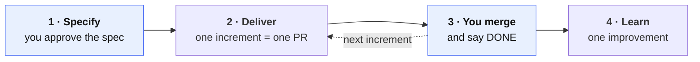
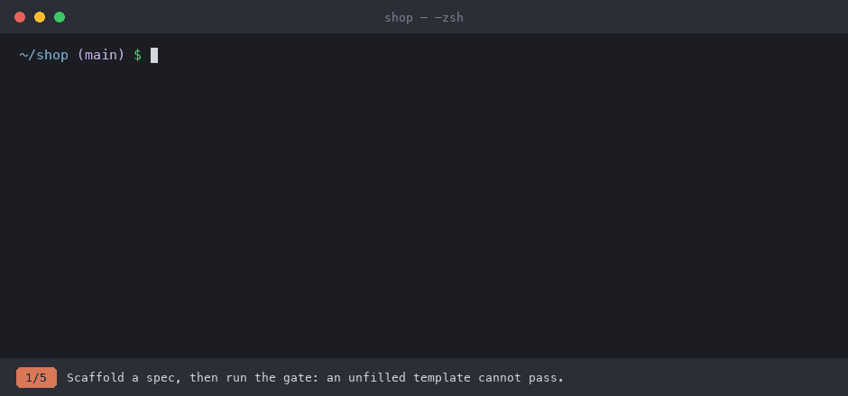
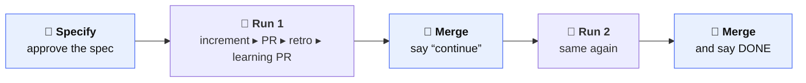

<div align="center">

# 🚦 DevGate

### Spec first. Gates in between. Evidence at the end.

**A spec-driven delivery workflow for AI coding agents.**<br/>
Ten plain `SKILL.md` files that turn "build me X" into reviewed, tested, one-PR-at-a-time delivery.<br/>
Drive it step by step, let one command run a whole increment, or **hand it to a headless agent** that works through the plan while you only approve and merge.


</div>

<br/>



<sub>Blue = you decide. Everything else is done by the agent, in fresh subagents. A headless agent can run step 2 for you: [`autonomous-workflow`](.agents/skills/autonomous-workflow).</sub>

<div align="center">



<sub>A condensed re-enactment of one real run (agent text verbatim, GitHub stubbed). Details below ▾</sub>

</div>

<details>
<summary><b>About this demo — what is real, what is not</b></summary>

<br/>

Condensed from one real run in a throwaway project, driven turn by turn with headless
<code>claude -p</code> (the answers and approvals were typed by the demo author, playing the user).
Agent text is verbatim, shortened with “…”; lefthook was real, GitHub was stubbed (<code>gh</code>
printed the PR URL) and the merge was done by hand. Not shown: discovery, the grill (in this run the
agent resolved its branches itself), five of the six section reviews, the plan details and session
capture. The window is a re-enactment.
<a href="docs/demo/render.py">How it was made</a>

</details>

## Why DevGate

Agents are fast. Left alone they are also fast at building the **wrong thing**, skipping tests and
quietly widening scope. DevGate puts a human-approved gate between every step — and keeps the
evidence, so the workflow improves with every spec.

## Three ways to run it

| | 🪜 **Step by step** | 🧑 **Interactive** | 🤖 **Headless** — [`autonomous-workflow`](.agents/skills/autonomous-workflow) |
| --- | --- | --- | --- |
| **You type** | one skill at a time: `/specify`, `/implement <spec> increment N`, `review`, `/learn` | `/deliver-increment <spec>` | `/autonomous-workflow <spec>` — or tell Hermes "run the workflow on spec X" |
| **One command =** | one phase | one increment → one draft PR | one increment → draft PR → **retro** → learning PR |
| **Commit and PR** | you | the agent | the agent |
| **A spec gap** | you decide | the agent asks you | the agent **decides and logs it** in the spec, then flags it in the PR |
| **Best for** | learning the workflow, or a task that needs close control | everyday use | long specs while you do something else |
| **You keep** | everything | the spec, the merge, `DONE` | the spec, the merge, `DONE` — it **never merges** |



<sub>Every PR the headless agent opens is an **Ask** draft that waits for you. It aborts, leaving everything resumable, on a blocked phase or after 5 review iterations. Specifying is never autonomous.</sub>

## Quick start

Needs a Unix shell, **Node.js ≥ 22** and **Python 3**. The skills are language-agnostic; C# / .NET code examples ship as references (more in *Requirements* below).

```bash
# 1. Copy the workflow into your project
cp -R DevGate/.agents  your-project/.agents

# 2. In your agent session, from the project
/specify                      # grill → spec → human review → ready-to-implement  (always with you)

# 3. Then pick a mode
/implement <spec> increment 1  # step by step: one phase, you stay in control (then `review`, commit, PR by hand)
/deliver-increment <spec>     # interactive: implement ▸ refactor ▸ review ▸ commit ▸ draft PR
/autonomous-workflow <spec>   # headless:    the same, plus a retro and a learning PR

# 4. Merge the PR, answer "continue", repeat — then say DONE
/learn <spec>                 # retro on the whole spec (headless already ran one per increment)
```

<details>
<summary><b>The gates — what DevGate enforces</b></summary>

<br/>

| | Gate | What it enforces |
| :-: | --- | --- |
| 🛑 | **Approval first** | No code until the spec is explicitly `ready-to-implement`. |
| 🔥 | **Grilled plans** | A relentless interview stress-tests the plan before it becomes a spec. |
| 👀 | **Human sign-off per section** | `Why`, `What`, `What NOT`, `Acceptance Criteria`, `Examples`, `Technical Notes` — one explicit ✅ each. |
| 📦 | **One increment = one PR** | One goal, shipped alone, reviewed before it is committed, green on the full harness. |
| 🧪 | **Tests first** | Every `[TEST]` criterion gets an automated test and a clause-level proof. |
| 🧹 | **Refactor every increment** | Not done until a subagent refactoring pass has run. |
| 🔎 | **Impact-aware review** | The diff *and* its blast radius are validated before sign-off. |
| 📈 | **Learning loop** | A retro on real conversations proposes at most one evidenced improvement. |

</details>

<details>
<summary><b>The four phases</b></summary>

<br/>

<table>
<tr>
<td width="25%" valign="top">

### 📝 specify
Define and approve the change **before** any code.

- discover context, scope, risks
- **grill** the plan
- human-review every section
- derive an ordered **Implementation Plan** of increments

</td>
<td width="25%" valign="top">

### 📦 deliver
Ship **one increment per PR**.

- `implement(N)` → `refactor(N)` → `review(N)` in **fresh subagents**
- reviewer auto-fixes until **PASS** (cap 5)
- full harness green, then one commit and an **Ask** draft PR
- N+1 starts after PR N merges

</td>
<td width="25%" valign="top">

### 🔍 review
Validate before a human signs off.

- scopes: changes · one increment · whole branch
- `[TEST]` coverage, quality, architecture
- blast-radius tracing
- reruns the harness itself, never trusts a claim of green

</td>
<td width="25%" valign="top">

### 📈 learn
Get better with every spec.

- extract the spec's sessions
- classify breakdown points, score, prioritise
- record findings in `docs/learnings/`
- suggest **one** evidenced fix, never apply it

</td>
</tr>
</table>

</details>

<details>
<summary><b>Where specs live</b></summary>

<br/>

A spec lives in `docs/backlog/` and moves through its lifecycle on its own:

```text
docs/backlog/
├── todo/          specifying → ready-to-implement
├── in-progress/   implementation-in-progress → implemented
├── done/          after your explicit DONE
└── rejected/
```

</details>

<details>
<summary><b>What's inside — 10 skills and 2 tools</b></summary>

<br/>

Everything lives in [`.agents/`](.agents):

| Skill | Role |
| --- | --- |
| [`specify`](.agents/skills/specify) | Create and refine specs, human-review each section, get approval |
| [`grilling`](.agents/skills/grilling) | Relentless interview that stress-tests a plan *(mandatory in specify)* |
| [`human-review-spec`](.agents/skills/human-review-spec) | Per-section review with the human *(mandatory in specify)* |
| [`deliver-increment`](.agents/skills/deliver-increment) | Orchestrates one increment: implement ▸ refactor ▸ review ▸ commit ▸ PR |
| [`autonomous-workflow`](.agents/skills/autonomous-workflow) | Entry point for a headless agent (e.g. Hermes): one increment ▸ its PR ▸ `learn` ▸ learning PR, then stops and asks to continue |
| [`implement`](.agents/skills/implement) | Implements ONE increment *(the `implement(N)` subagent)* |
| [`refactoring`](.agents/skills/refactoring) | Fowler's smells, SOLID, Uncle Bob — run after every increment |
| [`test-implementation`](.agents/skills/test-implementation) | FIRST, Given/When/Then, exclusion testing |
| [`review`](.agents/skills/review) | Quality gate before human sign-off |
| [`learn`](.agents/skills/learn) | Retrospective on a completed spec |

Plus two tools:

| Tool | Role |
| --- | --- |
| [`capture-spec-sessions`](.agents/tools/capture-spec-sessions) | Exports a spec's full conversation history (Warp, Claude Code or Hermes) as JSONL for `learn` |
| [`scripts/learnings.py`](.agents/scripts) | Stdlib-only writer and checker of the learning history in [`docs/learnings/`](docs/learnings/SCHEMA.md) |

</details>

<details>
<summary><b>Evidence: session capture</b></summary>

<br/>

Each phase emits a one-line shell no-op that binds its conversation to the spec:

```text
: SPEC_MARKER v=1 spec_id=<slug> phase=<specify|implement|review>
```

At each phase close, a wrapper writes a **decay-safe merged bundle** — even after the agent
runtime has evicted its own history:

```bash
.agents/tools/capture-spec-sessions/capture.sh --spec <slug> --source <warp|claude-code|hermes>
```

Works from any directory or git worktree; bundles land in the main checkout's gitignored
`spec-sessions/`. Always pass `--source`.

> Just want the capture, without the workflow? See
> [**agent-session-capture**](https://github.com/Amirault/agent-session-capture): one generic
> marker, any id, same adapters.

</details>

<details>
<summary><b>Core principles</b></summary>

<br/>

1. **No implementation before spec approval**
2. **The spec is the source of truth**
3. **Stop on ambiguity** — never invent behaviour
4. **Test what is marked `[TEST]`**
5. **An increment is done only after its refactoring pass**
6. **Reject scope creep** with the spec's *What NOT* section
7. **A headless agent never merges and never skips the stop**: `autonomous-workflow` opens only Ask PRs and asks before every next increment

</details>

<details>
<summary><b>Requirements &amp; adaptation</b></summary>

<br/>

- Unix-like shell, **Node.js ≥ 22** (the capture tool installs its own dependencies on first use), **Python 3** (`learnings.py`, stdlib only)
- **Warp**, **Claude Code** or **Hermes** as the session source — the marker must be in that runtime's local store; cloud sessions are not captured
- A project **harness**: `harness.md` assumes a Lefthook pre-commit hook run through `mise` — adapt [`harness.md`](.agents/skills/specify/references/harness.md) to your own checks
- **Language-agnostic**: `refactoring` and `test-implementation` state their rules in pseudo-code and ship a concrete [C# / .NET reference](.agents/skills/test-implementation/references/csharp.md) each; add `references/<language>.md` for yours
- Spec templates use generic project placeholders; scripts are shell, tested on macOS and Linux

</details>
