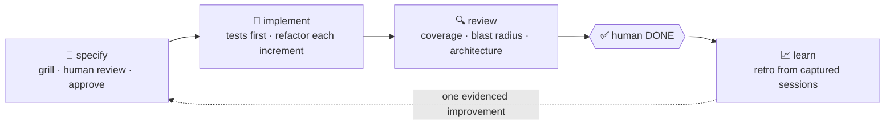

<div align="center">

# 🚦 DevGate

### Spec first. Gates in between. Evidence at the end.

A spec-driven delivery workflow for agent-assisted development — specify, implement, review, learn —
built from plain `SKILL.md` files you can drop into Claude Code, Warp or Hermes.


</div>

```text
specify  ──▶  implement  ──▶  review  ──▶  (human DONE)  ──▶  learn
  ▲ grill        ▲ test first      ▲ blast radius              ▲ evidence from
  ▲ human OK     ▲ refactor each   ▲ coverage                   real sessions
```

---

## ✨ Why DevGate

Agents are fast. Without guard rails they are also fast at building the **wrong thing**, skipping
tests, and quietly widening scope. DevGate puts a gate between every step, and keeps the evidence
so the workflow itself gets better with every spec.

| Gate | What it enforces |
| --- | --- |
| 🛑 **No code before approval** | Nothing is implemented until the spec is explicitly `ready-to-implement`. |
| 🔥 **Grilled plans** | A relentless interview stress-tests the plan before it becomes a spec. |
| 👀 **Human reviews every section** | `Why`, `What`, `What NOT`, `Acceptance Criteria`, `Examples`, `Technical Notes` — one explicit ✅ each. |
| 🧪 **Tests first** | Every `[TEST]` criterion gets an automated test and a clause-level proof matrix. |
| 🧹 **Refactor every increment** | An increment isn't done until a subagent refactoring pass has run. |
| 🔎 **Impact-aware review** | The diff *and* its blast radius are validated before human sign-off. |
| 📈 **Learn from the sessions** | A retrospective on real conversations suggests at most one evidenced harness improvement. |

## 🔄 The four phases



### 1 · specify
- discover context, clarify scope and risks
- **grill** the plan *(mandatory, Phase 3.5)*
- create/refine the spec in `docs/backlog/todo/`
- **human-review every section** *(mandatory, Phase 4.5)*
- derive the `## Implementation Plan`: ordered increments with What / How / Validation / Commit and an unchecked `**Refactoring**` sub-checkbox each
- get explicit approval (`ready-to-implement`)

### 2 · implement
- pick an approved spec, move it to `implementation-in-progress`
- implement increment by increment, following the plan
- add automated tests for `[TEST]` criteria and persist a clause-level proof matrix in `## Implementation Log`
- **refactor every increment** *(mandatory)* — the checkbox is ticked only after the pass

### 3 · review
- validate against the spec with an impact-aware review (the diff plus its blast radius)
- verify `[TEST]` coverage, quality, refactoring outcomes, architecture, build and tests
- list **post-merge increments** (all-`[MANUAL]`, runnable only after deploy): they never block PASS, but they block DONE
- move to `implemented` when the gate passes; close to `done` only after human `DONE`

### 4 · learn
- extract the spec's conversation bundle through `capture-spec-sessions`
- classify breakdown points (asset interpretation gaps, bad expectations, time cost, side improvements), score and prioritise
- **read-only**: suggests the fix, never applies it

## 🧰 What's inside

Everything lives under [`.agents/`](.agents):

| Skill | Role |
| --- | --- |
| [`specify`](.agents/skills/specify) | Create/refine specs in `docs/backlog/`, human-review each section, get approval |
| [`grilling`](.agents/skills/grilling) | Relentless interview that stress-tests a plan *(mandatory in specify Phase 3.5)* |
| [`human-review-spec`](.agents/skills/human-review-spec) | Per-section spec review with the human *(mandatory in Phase 4.5)* |
| [`implement`](.agents/skills/implement) | Execute an approved spec, increment by increment |
| [`refactoring`](.agents/skills/refactoring) | Fowler's smell catalog, SOLID, Uncle Bob — run by a subagent after every increment |
| [`test-implementation`](.agents/skills/test-implementation) | FIRST, Given/When/Then, exclusion testing |
| [`review`](.agents/skills/review) | Validate readiness before human sign-off |
| [`learn`](.agents/skills/learn) | Retrospective on a completed spec from captured sessions |
| [`tools/capture-spec-sessions`](.agents/tools/capture-spec-sessions) | Node tool that exports a spec's full conversation history (Warp, Claude Code or Hermes) as JSONL |

Each skill folder has a `SKILL.md` (behaviour and rules) plus helper scripts, references and
templates where useful.

## 📼 Session capture & traceability

Each phase emits a marker — a shell no-op — that binds its conversation to the spec:

```text
: SPEC_MARKER v=1 spec_id=<slug> phase=<specify|implement|review>
```

At each phase close, the wrapper writes a **decay-safe merged bundle**:

```bash
.agents/tools/capture-spec-sessions/capture.sh --spec <slug> --source <warp|claude-code|hermes>
```

- works from any cwd — repo root, a subdirectory, a git worktree
- installs its npm dependencies on first use, resolves node through `mise` when available
- stores bundles in the **main checkout's** `spec-sessions/` (gitignored), so a capture made in a
  disposable worktree outlives it
- always pass `--source` explicitly

That keeps every phase recoverable even after a runtime evicts its own history, so `learn` can
reconstruct what happened long after the fact.

> Want just the capture part, without the workflow? See
> [**agent-session-capture**](https://github.com/Amirault/agent-session-capture) — a generic
> marker + adapters, no specs or phases.

## 🚀 Getting started

**Prerequisites**
- Unix-like environment (the scripts are shell)
- **Node.js ≥ 22** for `capture-spec-sessions` — `capture.sh` installs dependencies on first use; for direct CLI use: `cd .agents/tools/capture-spec-sessions && npm install`
- **Warp**, **Claude Code** or **Hermes** as the session source — the marker must be in that runtime's local session store; remote (cloud) sessions are not captured *(documented gap)*

**Backlog layout the skills expect**

```text
docs/backlog/
├── todo/
├── in-progress/
├── done/
└── rejected/
```

## 🧭 Core principles

1. **No implementation before spec approval**
2. **The spec is the source of truth**
3. **Stop on ambiguity** — never invent behaviour
4. **Test what is marked `[TEST]`**
5. **Refactor every increment** — it isn't done until its refactoring pass has run
6. **Reject scope creep** using the spec's *What NOT* section

## 🔧 Adoption notes

- The `project` field in templates uses generic placeholders — adapt it to your project names.
- Scripts are shell-based, designed for Unix-like environments.
- Some skills keep references to their origin project (Wakam Pricing) in examples; adapt them to your context.
